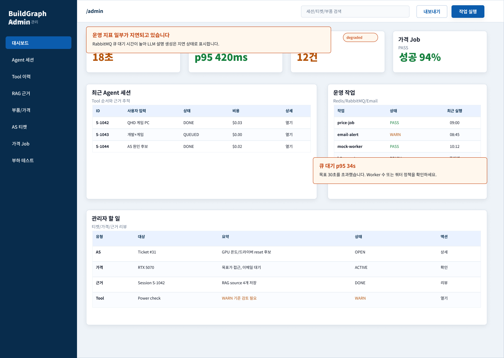
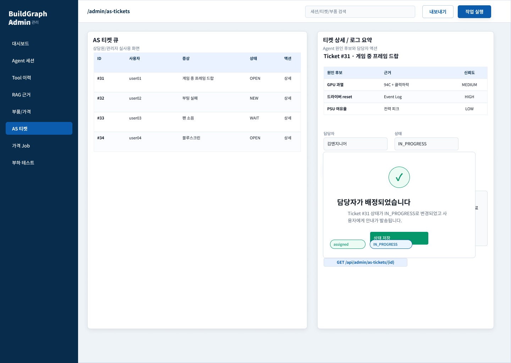

# 5번 담당 와이어프레임 범위 및 2주 계획

## 요약

5번 담당자는 Figma에서 **관리자 운영 대시보드와 관리자 공통 shell**을 맡는다.

직접 담당 화면은 `153:1880 STATE-15 ADMIN-01 운영 대시보드 / degraded`이며, `153:2011 STATE-16 ADMIN-04 AS 티켓 관리자 / assigned success`는 4번 화면이지만 AdminShell 참고용으로 확인해야 한다.

## 기준 자료

| 구분 | 기준 |
| --- | --- |
| Figma 섹션 | `138:2 SHOP-SPEC Real Desktop Screens - Compuzone style PLAN(2)` |
| 5번 직접 화면 | `153:1880 STATE-15 ADMIN-01 운영 대시보드 / degraded` |
| AdminShell 참고 화면 | `153:2011 STATE-16 ADMIN-04 AS 티켓 관리자 / assigned success` |
| 섹션 캡처 | `docs/hoseok/figma-138-2-section-overview.png` |
| 5번 화면 캡처 | `docs/hoseok/figma-153-1880-admin-dashboard-degraded.png` |
| Shell 참고 캡처 | `docs/hoseok/figma-153-2011-admin-as-ticket-shell-reference.png` |
| 소유권 문서 | `docs/ROUTE_OWNERSHIP.md`, `docs/role-workspaces.md` |

### 5번 직접 담당 화면: 관리자 운영 대시보드

### AdminShell 참고 화면: AS 티켓 관리자

이 화면 내부의 AS 티켓 목록/상세는 4번 담당이다. 5번은 좌측 sidebar, 상단 topbar, guard, layout slot만 참고한다.

## 5번이 맡아야 할 와이어프레임 파트

| 파트 | Figma에서 봐야 할 위치 | 구현 책임 | 관련 파일/API |
| --- | --- | --- | --- |
| AdminDashboard | `153:1880` 전체 화면의 본문 | `/admin` 첫 화면, 운영 요약, degraded 상태, metric card, 관리자 할 일 frame | `apps/web/src/features/admin/pages/AdminDashboardPage.tsx`, `GET /api/admin/dashboard`, `GET /api/admin/audit-logs/recent` |
| AdminShell sidebar | `153:1880`, `153:2011` 좌측 navy sidebar | 관리자 공통 navigation, active state, layout slot | `apps/web/src/components/layout/AdminShell.tsx` 또는 `features/admin/shell/**` |
| AdminShell topbar | `153:1880`, `153:2011` 상단 bar | route title, search placeholder, 내보내기/작업 실행 버튼 frame | `AdminShell`, 공통 button/control component |
| Admin guard | Figma 화면 자체보다는 `/admin/*` 진입 전 상태 | `ADMIN` 권한 확인, 401/403 분기, 권한 안내 화면 | `apps/web/src/features/auth/RequireAdmin.tsx`, `GET /api/auth/me` |
| Auth 공통/API | 로그인/회원가입 화면은 1번 화면이지만 연동은 5번 | token 저장, refresh/logout/me, OAuth exchange, API helper auth header | `apps/web/src/lib/api.ts`, `features/auth/authApi.ts`, `POST /api/auth/*`, `POST /api/users` |
| 공통 UI component | Figma 전반에 반복되는 table, badge, panel, metric, state message | 공통 layout/display/feedback contract 유지 | `apps/web/src/components/**`, `components/ui.tsx`는 barrel 유지 |
| Infra/CI/Health | 화면보다는 운영 대시보드의 기반 | Docker Compose, CI, OpenAPI 검증, `/api/health`, k6 smoke | `.github/workflows`, `infra`, `tools`, `GET /api/health` |

## 5번이 맡으면 안 되는 화면 내부

| 화면 | 주 owner | 5번 책임 |
| --- | --- | --- |
| `/admin/parts` 부품/가격 Job 내부 | 2번 | AdminShell, guard, 공통 component contract |
| `/admin/agent-sessions/:id` | 3번 | AdminShell, guard, route slot |
| `/admin/tool-invocations/:id` | 3번 | AdminShell, guard, route slot |
| `/admin/rag-evidence/:id` | 3번 | AdminShell, guard, route slot |
| `/admin/as-tickets`, `/admin/as-tickets/:ticketId` | 4번 | AdminShell, guard, route slot |
| `/login`, `/signup`, `/auth/callback` 화면 UI | 1번 | Auth API, token, OAuth, route guard 정책 |

## 현재 코드 기준으로 바로 봐야 할 차이

| 항목 | 현재 상태 | Figma/문서 기준 | 5번 다음 작업 |
| --- | --- | --- | --- |
| AdminShell nav | Dashboard, Agent/RAG, Parts/Price, AS Tickets | 대시보드, Agent 세션, Tool 이력, RAG 근거, 부품/가격, AS 티켓, 가격 Job, 부하 테스트 | nav label/link를 세분화할지 팀 합의 후 반영 |
| AdminDashboard DTO | 프론트 타입은 `llmQueueP95`, `apiP95`, `asOpen`, `recommendationSuccess` | OpenAPI는 `agentRunning`, `openTickets`, `priceJobsRunning`, `degraded`, `generatedAt` | API 계약과 프론트 타입 정합성 우선 해결 |
| Dashboard 본문 | metric 4개, 최근 Agent 세션, 운영 경고 | degraded alert, 운영 작업, 관리자 할 일 포함 | `/admin` frame을 Figma 기준으로 보강 |
| Topbar search/action | 현재 button 2개만 있음 | 검색 input, 내보내기, 작업 실행 | 동작 범위가 미확정이면 UI frame만 두고 action은 보류 |
| 권한 실패 화면 | `RequireAdmin`에서 안내 화면 표시 | 401/403 구분 필요 | 로그인 필요와 관리자 권한 없음 메시지 분리 |

## 2주 계획

### 1주차: 2026-06-29 월요일 ~ 2026-07-05 일요일

목표: 5번이 맡을 Figma 파트와 코드 책임을 고정하고, `/admin` 진입점과 dashboard API 정합성을 안정화한다.

| 날짜 | 작업 | 산출물 | 완료 기준 |
| --- | --- | --- | --- |
| 06-29 월 | 5번 담당 Figma 파트 확정 | 5번 전용 와이어프레임/2주 계획 문서 | `153:1880`은 5번 직접 화면, `153:2011`은 shell 참고 화면으로 분리 |
| 06-30 화 | AdminDashboard DTO 정합성 결정 | `AdminDashboard` 타입 정리 이슈 | OpenAPI를 바꿀지, 프론트를 맞출지 결정. 바꾸면 `docs/openapi.yaml`도 같은 PR 대상 |
| 07-01 수 | 테스트 먼저 작성할 범위 확정 | guard/dashboard/adminApi 테스트 목록 | `RequireAdmin`, `adminApi`, dashboard loading/error/success 기준 확정 |
| 07-02 목 | AdminShell 구조 정리 | sidebar/topbar slot contract | Shell에는 권한 판단과 도메인 데이터를 넣지 않음 |
| 07-03 금 | `/admin` dashboard 1차 정합성 | dashboard metric, degraded alert, loading/error 상태 | `GET /api/admin/dashboard`와 화면 필드가 충돌하지 않음 |
| 07-04 토 | 검증 및 PR 준비 | 검증 로그 | `npm --prefix apps/web run build`, `npm --prefix apps/web run test`, `python tools/validate_openapi.py` |
| 07-05 일 | 1주차 리뷰/버퍼 | 남은 이슈 목록 | 도메인 owner가 맡을 관리자 내부 화면과 5번 shell 책임을 다시 확인 |

### 2주차: 2026-07-06 월요일 ~ 2026-07-12 일요일

목표: 관리자 공통 진입점, 인증/권한, 인프라 검증을 팀 통합 흐름에 맞춘다.

| 날짜 | 작업 | 산출물 | 완료 기준 |
| --- | --- | --- | --- |
| 07-06 월 | AdminShell navigation 세분화 | Figma 기준 nav item/link 정리 | Agent 세션, Tool 이력, RAG 근거, 부품/가격, AS 티켓 route가 각 owner 화면으로 연결 |
| 07-07 화 | 401/403 권한 분기 고도화 | `RequireAdmin` 상태 분기 | token 없음은 로그인 필요, USER role은 관리자 권한 없음으로 구분 |
| 07-08 수 | Auth/API helper 점검 | `api.ts`, `authApi.ts` 정책 정리 | Authorization header, token 저장/삭제, refresh 확장 위치가 명확함 |
| 07-09 목 | Infra/health smoke 확인 | Docker/health 검증 기록 | `docker compose config`, `/api/health` DB 연결 기준 확인 |
| 07-10 금 | CI/k6 smoke 정리 | CI 체크와 k6 smoke 기준 | web build/test, OpenAPI, API bootJar, compose config가 PR 기준에 포함 |
| 07-11 토 | 통합 버그 수정 | Admin route smoke 결과 | `/admin`, `/admin/parts`, `/admin/as-tickets`가 guard와 shell을 정상 통과 |
| 07-12 일 | 다음 스프린트 backlog | 5번 남은 작업 목록 | 부하 테스트, audit logs, dashboard 확장, refresh token 고도화 항목 분리 |

## 5번 완료 기준

- `/admin`은 5번이 직접 담당하는 운영 대시보드로 구현된다.
- `/admin/*`는 모두 `RequireAdmin`을 통과한다.
- AdminShell은 layout/navigation만 맡고, 각 도메인 admin page 내부 데이터는 해당 owner가 맡는다.
- `AdminDashboardPage.tsx`와 `adminApi.ts`는 OpenAPI의 `AdminDashboardDto`와 필드명이 충돌하지 않는다.
- 공통 UI component 변경은 기존 prop contract를 깨지 않는다.
- API 요청/응답 구조를 바꾸면 `docs/API_CONTRACT.md`와 `docs/openapi.yaml`을 같은 변경에 포함한다.
- PR 전 최소 검증 명령을 남긴다.

## 5번 오늘 할 일

1. Figma 캡처에서 `153:1880`을 기준 화면으로 공유한다.
2. `153:2011`은 4번 화면이지만 AdminShell 참고용이라고 명시한다.
3. `AdminDashboardPage.tsx`와 `adminApi.ts`의 DTO 불일치를 첫 번째 이슈로 잡는다.
4. AdminShell nav를 Figma처럼 8개 항목으로 나눌지 팀에 확인한다.
5. Notion에는 "도메인 관리자 내부 화면은 각 owner, shell/guard/dashboard frame은 5번"이라고 남긴다.

